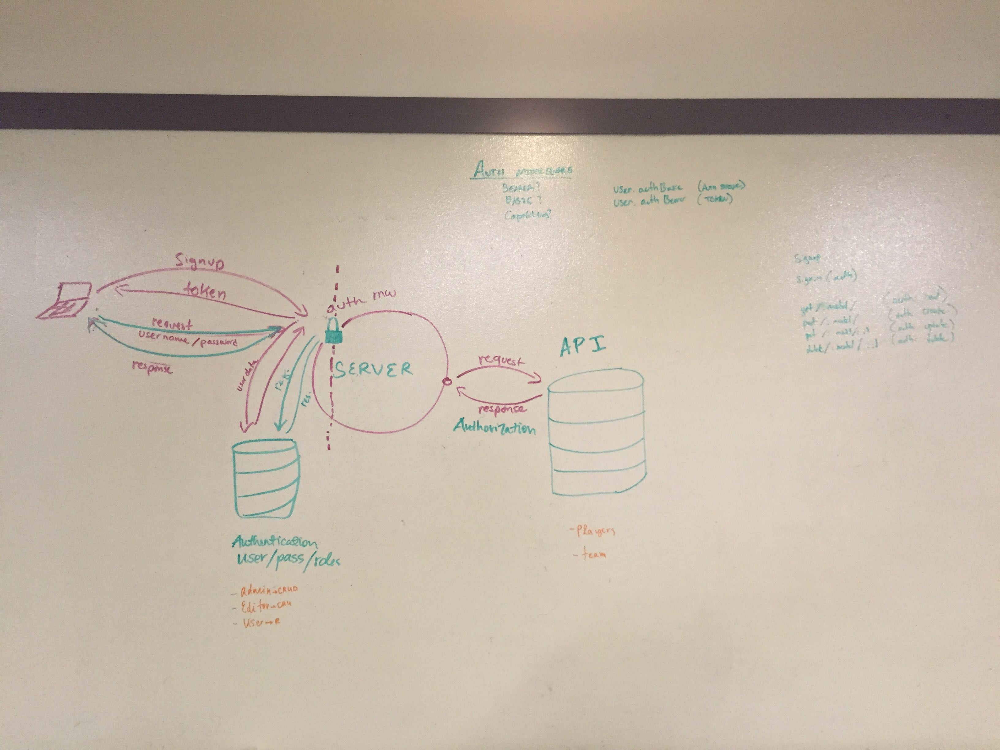

 LAB
=================================================

## Project Name: API Server

### Author: Hannah Ingham, George Raymond

### Links and Resources

* [repo](https://github.com/georgeraymond92/20-project-api)
* [travis](https://www.travis-ci.com/georgeraymond92/20-project-api)
* [heroku](https://git.heroku.com/auth-api-20.git)

#### Documentation
* [swagger](auth-api-20.herokuapp.com/api/v1/doc/)
* [jsdoc](auth-api-20.herokuapp.com/doc/)

### Modules
##### `roles-model.js, users-model.js, players-model.js, teams-model.js, router.js mongo.js`
##### Middleware: 
`404.js 500.js model-finder.js`

###### `foo(thing) -> string`
npm start
##### signup: echo 
`{"username":"example","password":"example-password"}' | http post :4000/signup`

##### Basic Singin: signin: 
`http :4000/signin -a example:example-password`

##### Basic new role:
`echo ‘{“role”:“test”,“capabilities”:[“test”]}’ | http post :3000/newrole`

##### Bearer signin: 
`http :4000/oauth "Authorization:Bearer ENTER TOKEN HERE`

####json-model-data 
* players and teams database
players: `{"name": "name", "team", "team"}`
team: `{"team": "team"}`

##### handleGetAll:
`http get :4000/api/v1/{model} -a username:password`

##### handleGetOne:
`http get :4000/api/v1/{model}/{id} -a username:password`

##### handlePost:
`echo '{ json-model-data }' | http post :4000/api/v1/{model} -a username:password`

##### handlePut:
`echo '{ json-model-data }' | http put :4000/api/v1/{model}/{id} -a username:password`

##### handleDelete:
` http delete :4000/api/v1/{model}/{id} -a username:password`

###### `foo(thing) -> string`
npm start
##### signup: echo 
`{"username":"example","password":"example-password"}' | http post :4000/signup`

##### Basic Singin: signin: 
`http :4000/signin -a example:example-password`

##### Bearer signin: 
`http :4000/oauth "Authorization:Bearer ENTER TOKEN HERE`

####json-model-data 
* players or teams
players: `{"name": "name", "team", "team"}`
team: `{"team": "team"}`

##### handleGetAll:
`http get :4000/api/v1/{model} -a username:password`

##### handleGetOne:
`http get :4000/api/v1/{model}/{id} -a username:password`

##### handlePost:
`echo '{ json-model-data }' | http post :4000/api/v1/{model} -a username:password`

##### handlePut:
`echo '{ json-model-data }' | http put :4000/api/v1/{model}/{id} -a username:password`

##### handleDelete:
` http delete :4000/api/v1/{model}/{id} -a username:password`

### Setup
#### `.env` requirements
* `PORT` - 4000
* `MONGODB_URI` - mongodb://localhost:27017/users
* `SECRET` - string for mongo secret

#### Running the app
* `npm start`
* Endpoint: app.js
* Endpoint: `/signin`
  * Enters user in the mongo database
* Endpoint: `/singin`
  * Signs in a user with correct credentials
* Endpoint: `/oauth`
  * Signs in a user with bearer authorization (with a token)

* Endpoint: `/signup`
  * Enters user in the mongo database and allows them to signup
* Endpoint: `/singin`
  * Signs in a user with correct credentials
* Endpoint: `/newrole`
  * Allows users to add a new role into the database

  
#### Tests
* How do you run tests? 
`npm run tests`

#### UML

